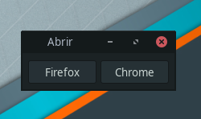

# choosebrowser



Un script Bash minimalista que permite elegir el navegador a utilizar cuando se abre un link.

## Dependencias

- yad (`sudo apt install yad`)

## Instalación

### Clonar repositorio y crear soft link

```
$ git clone <repo url>
$ cd choosebrowser
$ chmod +x choosebrowser.sh
$ sudo ln -s choosebrowser.sh /usr/local/bin/choosebrowser
```

### Definir choosebrowser como navegador por defecto

Dependiendo del desktop environment (Gnome, XFCE, KDE, etc), la ubicación de esta configuración será diferente.

Generalmente en el panel de configuración o en el menú de aplicaciones hay una opción llamada "Aplicaciones preferidas" y desde ahí puede elegirse el navegador por defecto. Seleccionar  `/usr/local/bin/choosebrowser`

## Actualizar

Se puede hacer pull del depositorio para bajar nuevas versiones del script, pero tener en cuenta que si se modificaron valores en la configuración, existe la posibilidad de que surjan conflictos al hacer merge de los cambios, aunque no deberían ser muy graves.

```
cd choosebrowser
git pull
```

## TODO

- Extraer configuración a un archivo externo
- Mostrar íconos de navegadores en lugar de sólo el nombre